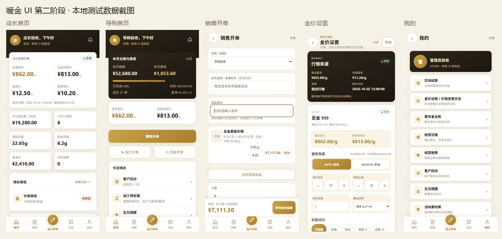

# 移动端 UI 第二阶段验收记录

验收日期：2026-10-02。起点为本地 main 的 07d1e9f（提示词中的 4ce13ae 已有后续提交）。仅新增、修改 mobile/。三份指定 HTML 仅用于视觉参考；原型数据与演示脚本未进入业务页面。远端 main 查询超时，本次以本地 main 为基线。

## 提交安排

1. 5f7b196 — 移动端UI改版-第二阶段：设计token与通用组件
2. 403a927 — 移动端UI改版-第二阶段：首页/开单/金价设置/单据/消息/我的
3. 移动端UI改版-第二阶段：其余页面套用与测试更新（本记录随第三次提交保存）

三次提交正文均包含“移动端UI改版-暖金设计语言-第二阶段”。仅本地存档。

## 设计 token 与组件

| 分组 | 统一定义 |
| --- | --- |
| 基础颜色 | --gold #b0832e；--ink #221c14；--bg #f6f1e7；--card #fff |
| 渐变 | --gold-gradient #c9a24b → #a87f2c；--dark-gradient #2e261b → #1b1610 |
| 状态 | --err #c0453b（红涨/警示）；--ok #2f7d5c（绿跌/成功） |
| 边框 | --line #efe4cc；--line-strong #e7dcc6；暖金浅底及状态浅底 token |
| 尺寸 | --r-md 13px；--r-lg 16px；--tap 44px；--button-h 54px；--tab-h 64px |
| 排版/动效 | --f-money 24px；金额 tabular-nums；4–24px 间距；160/220ms 交互和页面切换；减少动态效果偏好 |
| 安全区 | 页面、底栏、弹层、固定按钮使用 safe-area-inset-bottom；使用 dvh，无 100vh |

统一来源：src/styles/app.css。DesignHeader、Panel、Chip、Stepper、StatusPill、EmptyState、Toast/useToast 供页面复用。MarketQuoteBar 直接取 salePrice/recyclePrice；HomeWelcome 统一深棕欢迎区；BottomNav 固定五位，第二位为单据，中间笔形按钮直达加工开单；PriceLockBadge 只用于确认提交后的按克订单。

RoleHome 按页面 section 拆分至 src/views/home/，保留共享状态和业务动作。其余页面使用统一页头、空态、筛选、表单、卡片、按钮和图表配色。现有图表使用 SVG/CSS，保留现有渲染方式；未新增 ECharts 或 uview-plus 源码引用。

## 行为与范围

- 店长/导购首页仅显示最后卖价与回收价，店长额外显示银价。完整定价配置与价格日志入口保留给 ADMIN，仍经过现有 auth.can('gold:manage') 和路由检查。
- CASHIER 登录即登出的逻辑、权限码、路由守卫、接口契约与 WebSocket 事件定义保持原状。src/main.js、src/api/、src/stores/ 及定价计算工具无变更。
- 店长近七日趋势无数据时隐藏整卡。导购进度来自既有业绩与目标接口。
- 销售开单仍为“转交前台结算”。实收由收银端记录；草稿不展示已锁价，创建请求成功后显示订单回执与按克订单锁价标签。原有锁价说明、导购选择、会员选择、库存校验和旧金抵扣保留。
- 单据页并行复用 reportSales、processingOrders、reportRecycle，按时间排序，销售行按单号聚合避免重复累加订单金额。查询按原权限显隐；失败来源单独提示，其余记录继续显示。
- **单据范围**：销售与回收采用现有报表查询的本月记录；加工采用现有加工列表。页面明确标注该范围。当前没有新增聚合接口、全历史查询或新权限。
- 金价页保留 AUTO/MANUAL、全部取整规则、自动定价校验、跨端更新保护、异常冻结恢复及原 updateGoldType 参数。
- 旧页面读取金价改用明确的 salePrice/recyclePrice；货品详情缺少卖价时展示“待同步金价”，海报展示待确认文案，移除旧的 612 假定值。

## 自动验收

- pnpm test：**33 个测试文件、89 项测试通过**（包含原有测试）。新增覆盖共享控件、角色首页显隐、空趋势、真实提交后锁价标记、单据并行加载/权限/局部失败/排序筛选，以及金价字段与缺失报价。
- npm run build：**成功**，481 个模块；输出 dist/build/h5/。最大 JS 分包约 511.47kB，Vite 提示超过 500kB，该提示保留。
- 详细输出：[测试](test-results.txt)、[构建](build-results.txt)。
- mobile 范围 git diff --check 通过；Vue 模板静态绑定检查未发现缺失引用；生产产物没有加载 QA 入口。

## 浏览器验收与截图

使用独立 127.0.0.1:5190 测试站点，真实 mobile 组件/路由 + 本地模拟接口；页面姓名、商品和金额均为显式测试数据。该入口只存在 qa/ui/，生产入口未引用。没有请求或写入门店后端。

在 320px、390px、430px 检查核心页面；320px 另检查库存、入库四页、盘点四页、货品查询/详情、会员详情、交班、日报、客存金、活动素材、回访、生日、待办、报价、消息、登录、403。入库/盘点扫描页通过准备页建立测试草稿进入，并检查带商品的状态。共记录 52 次布局测量：无横向溢出；浏览器控制台无 error。桌面滚动条占用 15px 时也可容纳页面。

交互走查：加工快捷按钮直达、单据筛选和详情、入库与盘点准备到扫码、金价步进联动公式、AUTO/MANUAL 切换、核心点击区 ≥44px。固定底栏、结算栏以及安全区样式已核对。实体手机的相机、扫码、打印、系统权限和 Capacitor 安全区仍需真机回归；此轮为 H5 构建与本地 UI 验收。

复现：在 mobile 运行 node qa/ui/server.mjs，访问 /manager/dashboard?qaRole=MANAGER、/sales/home?qaRole=SALES、/sales/order?qaRole=SALES、/gold-settings?qaRole=ADMIN、/admin/profile?qaRole=ADMIN。条码 QA001。登录界面使用 /login?qaLoggedOut=1。测试服务与临时浏览器页面已在验收后关闭。

[布局测量结果](layout-results.json)

- [店长首页完整截图](screenshots/manager-home.jpg)
- [导购首页完整截图](screenshots/sales-home.jpg)
- [销售开单完整截图](screenshots/sales-order.jpg)
- [金价设置完整截图](screenshots/gold-settings.jpg)
- [我的完整截图](screenshots/profile.jpg)

## 完整改动文件清单

相对 07d1e9f，仅列 mobile/；含本地验收资料。

- mobile/qa/ui/README.md
- mobile/qa/ui/bootstrap.js
- mobile/qa/ui/build-results.txt
- mobile/qa/ui/layout-results.json
- mobile/qa/ui/screenshots/gold-settings-viewport.jpg
- mobile/qa/ui/screenshots/gold-settings.jpg
- mobile/qa/ui/screenshots/manager-home-viewport.jpg
- mobile/qa/ui/screenshots/manager-home.jpg
- mobile/qa/ui/screenshots/overview.jpg
- mobile/qa/ui/screenshots/profile-viewport.jpg
- mobile/qa/ui/screenshots/profile.jpg
- mobile/qa/ui/screenshots/sales-home-viewport.jpg
- mobile/qa/ui/screenshots/sales-home.jpg
- mobile/qa/ui/screenshots/sales-order-viewport.jpg
- mobile/qa/ui/screenshots/sales-order.jpg
- mobile/qa/ui/server.mjs
- mobile/qa/ui/test-results.txt
- mobile/src/App.vue
- mobile/src/components/BottomNav.vue
- mobile/src/components/CategoryPie.vue
- mobile/src/components/Chip.vue
- mobile/src/components/DesignControls.spec.js
- mobile/src/components/EmptyState.vue
- mobile/src/components/GoldTrend.vue
- mobile/src/components/HomeWelcome.vue
- mobile/src/components/MarketQuoteBar.vue
- mobile/src/components/MemberList.vue
- mobile/src/components/PageTitle.vue
- mobile/src/components/Panel.vue
- mobile/src/components/PriceLockBadge.vue
- mobile/src/components/ProfilePanel.vue
- mobile/src/components/ScanCodeButton.vue
- mobile/src/components/StatusPill.vue
- mobile/src/components/Stepper.vue
- mobile/src/components/Toast.vue
- mobile/src/composables/useToast.js
- mobile/src/config/roles.js
- mobile/src/styles/app.css
- mobile/src/styles/mobileLayout.spec.js
- mobile/src/utils/documents.js
- mobile/src/utils/documents.spec.js
- mobile/src/views/ActivityLibrary.vue
- mobile/src/views/BirthdayReminder.vue
- mobile/src/views/DailyReport.vue
- mobile/src/views/DepositLedger.vue
- mobile/src/views/Forbidden.vue
- mobile/src/views/GoldSettings.vue
- mobile/src/views/GoodsDetail.spec.js
- mobile/src/views/GoodsDetail.vue
- mobile/src/views/GoodsSearch.vue
- mobile/src/views/HomeDesign.spec.js
- mobile/src/views/InboundCreate.vue
- mobile/src/views/InboundDetail.vue
- mobile/src/views/InboundHistory.vue
- mobile/src/views/InboundScan.spec.js
- mobile/src/views/InboundScan.vue
- mobile/src/views/InventoryOverview.vue
- mobile/src/views/Login.vue
- mobile/src/views/MemberDetail.vue
- mobile/src/views/Notifications.spec.js
- mobile/src/views/Notifications.vue
- mobile/src/views/PendingTasks.vue
- mobile/src/views/ProcessingOrders.spec.js
- mobile/src/views/ProcessingOrders.vue
- mobile/src/views/RecycleCreate.spec.js
- mobile/src/views/RecycleCreate.vue
- mobile/src/views/ReportDashboard.vue
- mobile/src/views/RoleHome.vue
- mobile/src/views/RoleHomeNavigation.spec.js
- mobile/src/views/SalesCalculator.vue
- mobile/src/views/Shift.vue
- mobile/src/views/SilverPriceDisplay.spec.js
- mobile/src/views/StockCheckCreate.vue
- mobile/src/views/StockCheckDetail.vue
- mobile/src/views/StockCheckHistory.vue
- mobile/src/views/StockCheckScan.vue
- mobile/src/views/VisitsPage.vue
- mobile/src/views/home/ApprovalsSection.vue
- mobile/src/views/home/DocumentsSection.spec.js
- mobile/src/views/home/DocumentsSection.vue
- mobile/src/views/home/GoodsSection.vue
- mobile/src/views/home/KpiDetailSection.vue
- mobile/src/views/home/ManagerHome.vue
- mobile/src/views/home/ManagerMembersSection.vue
- mobile/src/views/home/ManagerReportSection.vue
- mobile/src/views/home/MembersSection.vue
- mobile/src/views/home/MessagesSection.vue
- mobile/src/views/home/PerformanceSection.vue
- mobile/src/views/home/ProfileSection.vue
- mobile/src/views/home/SalesGoodsSection.vue
- mobile/src/views/home/SalesHome.vue
- mobile/src/views/home/SalesOrderSection.vue
- mobile/src/views/home/TrendSection.vue
- mobile/src/views/home/context.js
- mobile/tests/roles.test.js
